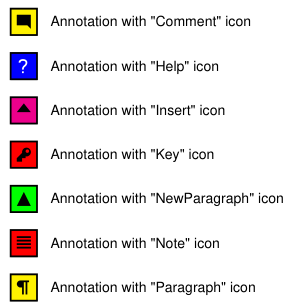

# Annotations

Since version 3.0.13, annotations can be added within the `PdfDocument`.

**Definition:**

```php
annotation(
    string $text,
    ?float $x = null,
    ?float $y = null,
    ?float $width = null,
    ?float $height = null,
    PdfAnnotationName $name = PdfAnnotationName::NOTE,
    ?PdfColorInterface $color = null
)
```

**Parameters:**

- `$text`: The annotation text.
- `$x`: The abscissa of the upper-left corner or `null` to use the current
  abscissa.
- `$y`: The ordinate of the upper-left corner or `null` to use the current
  ordinate.
- `$width`: The width of the annotation or `null` to compute the text width.
- `$height`: The height of the annotation or `null` to use the default line
  height.
- `$name`: The annotation name (icon).
- `$color`: The annotation color or `null` for default (black).

**Example:**

```php
use fpdf\PdfDocument;
use fpdf\Enums\PdfDestination;

$y = 0.0;
$top = $doc->getTopMargin();
$left = $doc->getLeftMargin() + 5.0;
$names = PdfAnnotationName::cases();
$colors = [
    PdfRgbColor::red(),
    PdfRgbColor::green(),
    PdfRgbColor::blue(),
    PdfCmykColor::cyan(),
    PdfCmykColor::magenta(),
    PdfCmykColor::yellow(),    
];

foreach ($names as $name) {
    $text = \sprintf('Annotation with "%s" icon', $name->value);
    $color = $colors[\array_rand($colors)];
    $doc->annotation(
        text: $text,
        x: 0,
        y: $y,
        width: 18,
        height: 18,
        name: $name,
        color: $color,
    );
    $doc->text($left, $top + $y, $text);
    $y += 10.0;
}

$doc->output();
```

**Result:**



**See also:**

- [Examples](examples.md)
- [Home](../README.md)
