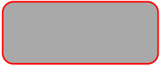

# Rounded Rectangle

Since version `4.3.7`, a trait allows drawing rounded rectangles.

**Note:** The code is inspired from this given
[FPDF script](https://www.fpdf.org/en/script/script7.php) created by
Maxime Delorme.

**Definition:**

```php
public function roundedRect(
    float $width,
    float $height,
    float $radius,
    ?float $x = null,
    ?float $y = null,
    PdfRectangleStyle $style = PdfRectangleStyle::BOTH,
    PdfMove $move = PdfMove::RIGHT
)
```

**Parameters:**

- `$width`: the width of the rectangle
- `$height`: the height of the rectangle
- `$radius`: the radius of the corners
- `$x`: the abscissa of the rectangle or `null` to use the current abscissa
- `$y`: the ordinate of the rectangle or `null` to use the current ordinate
- `$style`: the style of rendering
- `$move`: indicates where the current position should go after the call

**Usage:**

To use it, create a derived class and use the `PdfRoundedRectangleTrait` trait:

```php
use fpdf\PdfDocument;
use fpdf\Color\PdfRgbColor;
use fpdf\Enums\PdfRectangleStyle;
use fpdf\Traits\PdfRoundedRectangleTrait;

class PdfRoundedRectangleDocument extends PdfDocument
{
    use PdfRoundedRectangleTrait;
}

// instanciation of inherited class
$pdf = new PdfRoundedRectangleDocument();
$pdf->addPage();
$pdf->setLineWidth(1.5);
$pdf->setDrawColor(PdfRgbColor::red());
$pdf->setFillColor(PdfRgbColor::darkGray());
$pdf->roundedRect(10, 20, 50, 20, 3.5);
$pdf->output();
```

**Result:**



**See also:**

- [Examples](examples.md)
- [Home](../README.md)
