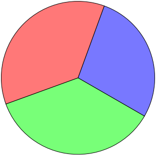

# Sector

Since version `2.0.6`, A trait allows drawing sector of a circle. It can be
used, for example, to render a pie chart.

**Note:** The code is inspired from this given
[FPDF script](http://www.fpdf.org/en/script/script19.php) created by
Maxime Delorme.

**Definition:**

```php
sector(
    float $centerX,
    float $centerY,
    float $radius, 
    float $startAngle,
    float $endAngle,
    PdfRectangleStyle $style = PdfRectangleStyle::BOTH,
    boolean $clockwise = true,
    float $origin = 90
)
```

**Parameters:**

- `$centerX`: The abscissa of the center.
- `$centerY`: The ordinate of the center.
- `$radius`: The radius.
- `$startAngle`: The starting angle in degrees.
- `$endAngle`: The ending angle in degrees.
- `$style`: The style of rendering.
- `$clockwise`: Indicates whether to go clockwise (true) or counter-clockwise
  (false).
- `$origin`: the origin,in degrees, of angles (0=right, 90=top, 180=left,
  270=for bottom).

All angle parameters are expressed in degrees (&deg;).

**Usage:**

To use it, create a derived class and use the `PdfSectorTrait` trait:

```php
use fpdf\Color\PdfRgbColor;
use fpdf\PdfDocument;
use fpdf\Traits\PdfSectorTrait;

class SectorDocument extends PdfDocument
{
    use PdfSectorTrait;
}

$radius = 40;
$centerX = 105;
$centerY = 60;

// instanciation of inherited class
$pdf = new SectorDocument();
$pdf->addPage();
// first sector
$pdf->setFillColor(PdfRgbColor::instance(120, 120, 255));
$pdf->sector($centerX, $centerY, $radius, 20, 120);
// second sector
$pdf->setFillColor(PdfRgbColor::instance(120, 255, 120));
$pdf->sector($centerX, $centerY, $radius, 120, 250);
// third sector
$pdf->setFillColor(PdfRgbColor::instance(255, 120, 120));
$pdf->sector($centerX, $centerY, $radius, 250, 20);

$pdf->output();
```

**Result:**



**See also:**

- [Examples](examples.md)
- [Home](../README.md)
