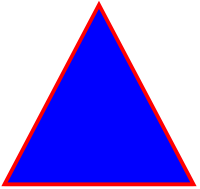

# Polygon

Since version `3.0.12`, a trait allows drawing polygon.

**Note:** The code is inspired from this given
[FPDF script](https://www.fpdf.org/en/script/script60.php) created by
Andrew Meier.

**Definition:**

```php
polygon(array $points, PdfRectangleStyle $style = PdfRectangleStyle::BORDER)
```

**Parameters:**

- `$points`: an array of `PdfPoint` to draw.
- `$style`: the style of rendering.

**Usage:**

To use it, create a derived class and use the `PdfPolygonTrait` trait:

```php
use fpdf\PdfDocument;
use fpdf\Traits\PdfPolygonTrait;

class PolygonDocument extends PdfDocument
{
    use PdfPolygonTrait;
}

$points = [
    new PdfPoint(50, 115),
    new PdfPoint(150, 115),
    new PdfPoint(100, 20),
];

// instanciation of inherited class
$pdf = new PolygonDocument();
$pdf->addPage();
$pdf->setLineWidth(2.0);
$pdf->setDrawColor(PdfRgbColor::red());
$pdf->setFillColor(PdfRgbColor::blue());
$pdf->polygon($points, PdfRectangleStyle::BOTH);
```

**Result:**



**See also:**

- [Examples](examples.md)
- [Home](../README.md)
