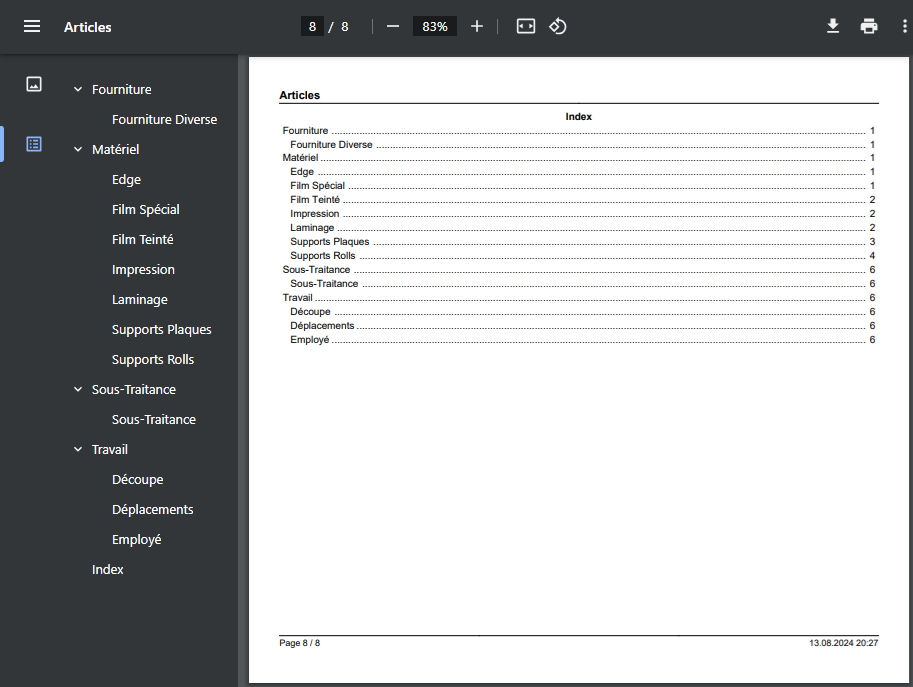

# Bookmarks

Since version `2.0.2`, bookmarks can be added within the `PdfDocument`.

To use it, create a derived class and use the `PdfBookmarkTrait` trait:

```php
use fpdf\PdfDocument;
use fpdf\Traits\PdfBookmarkTrait;

class BookmarkDocument extends PdfDocument
{
    use PdfBookmarkTrait;
}

// instanciation of inherited class
$pdf = new BookmarkDocument();
// add root bookmark (level 0) 
$pdf->addBookmark('Root Bookmark');
// add child bookmark
$pdf->addBookmark('Child Bookmark', level: 1);
```

The given trait can also output a new index page with all bookmarks. The index
page contains a centered title ('Index') and for each bookmark:

- The bookmark text on the left.
- A character separator ('.') between the bookmark text and the page number.
- The page number on the right.

Call the following function before closing or outputting the document:

```php
$pdf->addPageIndex();
```

After calling this function, the font name, style and size are restored to the
previous values.

**Screenshot:**



**See also:**

- [Minimal example](tuto_1.md)
- [Header, footer, page break and image](tuto_2.md)
- [Line breaks and colors](tuto_3.md)
- [Multi-columns](tuto_4.md)
- [Tables](tuto_5.md)
- [Transparency](tuto_7.md)
- [Circles and ellipses](tuto_8.md)
- [Home](../README.md)
