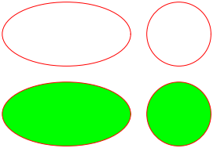

# Circles and ellipses

Since version `2.0.4`, ellipses and circles can be drawn within
the `PdfDocument`.

**Note:** The code is inspired from this given
[FPDF script](http://www.fpdf.org/en/script/script6.php) created by Olivier.

**Ellipse Definition:**

```php
ellipse(
    float $x,
    float $y,
    float $rx,
    float $ry,
    PdfRectangleStyle $style = PdfRectangleStyle::BORDER
)
```

**Ellipse Parameters:**

- `$x`: The abscissa of the center.
- `$y`: The ordinate of the center.
- `$rx`: The horizontal radius.
- `$ry`: The vertical radius.
- `$style`: The style of rendering.

***Circle Definition:***

```php
circle(
    float $x,
    float $y,
    float $r,
    PdfRectangleStyle $style = PdfRectangleStyle::BORDER
)
```

**Circle Parameters:**

- `$x`: The abscissa of the center.
- `$y`: The ordinate of the center.
- `$r`: The radius.
- `$style`: The style of rendering.

**Usage:**

To use it, create a derived class and use the `PdfEllipseTrait` trait:

```php
use fpdf\Color\PdfRgbColor;
use fpdf\Enums\PdfRectangleStyle;
use fpdf\PdfDocument;
use fpdf\Traits\PdfEllipseTrait;

class EllipseDocument extends PdfDocument
{
    use PdfEllipseTrait;
}

// instanciation of inherited class
$pdf = new EllipseDocument();
// output an ellipse and a circle with border only
$pdf->setDrawColor(PdfRgbColor::red());
$pdf->ellipse(30, 220, 20, 10);
$pdf->circle(65, 220, 10);
// output an ellipse and a circle with border and fill colors
$pdf->setFillColor(PdfRgbColor::green());
$pdf->circle(65, 245, 10, PdfRectangleStyle::BOTH);
$pdf->ellipse(30, 245, 20, 10, PdfRectangleStyle::BOTH);
```

**Result:**



**See also:**

- [Examples](examples.md)
- [Home](../README.md)
