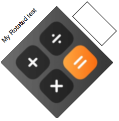

# Rotation

Since version `2.0.5`, A trait allows performing rotation around a
given center.

**Note:** The code is inspired from this given
[FPDF](http://www.fpdf.org/en/script/script2.php) script created by Olivier.

The rotation affects all elements, which are printed after the method call
(except clickable areas). Rotation is not kept from page to page.
Each page begins with no rotation.

Only the display is altered. The `getX()` and `getY()` methods are not
affected, nor the automatic page break mechanism.

All angle parameters are expressed in degrees ('&deg;').

To use it, create a derived class and use the `PdfRotationTrait` trait:

```php
use fpdf\PdfDocument;
use fpdf\Traits\PdfRotationTrait;

class RotationDocument extends PdfDocument
{
    use PdfRotationTrait;
}

// instanciation of inherited class
$pdf = new RotationDocument();
// rotate text by 45 degrees
$pdf->rotateText('My Rotated test', 45, 10, 50);
// rotate rectangle
$pdf->rotateRect(50, 30, 20, 10, -45);
// rotate image
$pdf->rotate(45, 60, 40);
$pdf->image('logo.png');
$pdf->endRotate();
```

**Result:**



**See also:**

- [Minimal example](tuto_1.md)
- [Header, footer, page break and image](tuto_2.md)
- [Line breaks and colors](tuto_3.md)
- [Multi-columns](tuto_4.md)
- [Tables](tuto_5.md)
- [Bookmarks](tuto_6.md)
- [Transparency](tuto_7.md)
- [Circles and ellipses](tuto_8.md)
- [Sector](tuto_10.md)
- [Home](../README.md)
